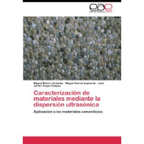
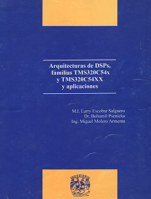

Title: Publications

Journals
----

**2014**
   
14.-  Optimized OpenCL implementation of the Elastodynamic Finite Integration Technique for viscoelastic media Computer Physics Communications  185 (10), 2014, pp 2683-2696
**Molero-Armenta M.**, Iturraran-Viveros U., Aparicio S., Hernández M.G.
              

13.- Monitoring of Freeze-Thaw Cycles in Concrete Using Embedded Sensors and Ultrasonic Imaging, Sensors 14, 2014, pages 2280-2304. 
Ranz, J.; Aparicio, S.; Romero, H.; Casati, M.J.; **Molero, M.**; González, M.
                  

**2013**

  
12.- Simulation of sonic waves along a borehole in heterogeneous formation: Accelerating 2-5D finite differences using [Py]OpenCL 
Computers & Geosciences 56, 2013, pages 161-169.
U. Iturraran-Viveros, **M. Molero** 
         
11.-  Accelerating numerical modeling wave propagation through 2-D anisotropic materials using OpenCL, Ultrasonics 53 (3), 2013, pages 815-822. **M. Molero**, U. Iturráran-Viveros 

10.-Decalcification of Cement Mortars: Characterisation and Modelling, Cement and Concrete Composites 35 (1), 2013, pages 136-150, I. Segura, **M. Molero**, S. Aparicio, J.J. Anaya, A. Moragues

**2012**

9.- Evaluation of freeze-thaw damage in concrete by ultrasonic imaging, NDT&E International 52, 2012, pages 86-94. **M. Molero**, S. Aparicio, G. Al-Assadi, M.J. Casati, M.G. Hernández, J.J. Anaya

8.- Comparison of Phase velocity in trabecular bone mimicking-phantoms by time domain numerical (EFIT) and analytical multiple scattering approaches, Ultrasonics 52 (7), 2012, pages 809-814
**M. Molero**, L. Medina

**2011**

7.- Influence of aggregates and air voids on the ultrasonic velocity and attenuation in cementitious materials, European Journal of Enviromental and Civil Engineering, Volume 15, Issue 4, April 2011, Pages 501-517,  (SCI Expanded). **M. Molero**, I segura, S. Aparicio, J.V. Fuente,

6.- Study of the influence of microstructural parameters on the ultrasonic velocity in steel fiber reinforced cementitious materials, Construction & Building Materials, Volume 25, Issue 7, July 2011, Pages 3066-3072 M. Acebes, **M. Molero**, I. Segura, A. Moragues, M.G. Hernández,

5.- Ultrasonic wave propagation in cementitious materials: A multiphase approach of a self-consistent multiple scattering model, Ultrasonics, Volume 51, Issue 1, January 2011, Pages 71-84  **M. Molero**, I. Segura, M.G. Hernández, M.A.G. Izquierdo, J.J. Anaya,

**2010**

4.- On the measurement of frequency-dependent ultrasonic attenuation in strongly heterogeneous materials, Ultrasonics, Volume 50, Issue 8, August 2010, Pages 824-828
**M. Molero**, I. Segura, S. Aparicio, M.G. Hernández, M.A.G. Izquierdo,

3.- Measurement of the degraded depth in cementitious materials by automatic digital image processing, Measurement and Science Technology, Volume 21, Issue 5, May 2010, Pages 1-12
I. Segura, **M. Molero**, S. Aparicio, A. Moragues,

**2009**	

2.- Study of the decalcification process in mortars by NH4NO3 by using ultrasonic techniques
Materiales de Construcción, Volume 59, Issue 296, Oct-Dec 2009, Pages 17-36
I. Segura, A. Moragues, D.E. Macphee, J.J. Anaya, **M. Molero**,

1.- Sand/cement ratio evaluation on mortar using neural networks and ultrasonic transmission inspection, Ultrasonics, Volume 49, Issue 2, February 2009, Pages 231-237
**M. Molero**, I. Segura, M.A.G. Izquierdo, J.V. Fuente, J.J. Anaya,

International Congress Proceedings
-----

**2013**

14.- Modeling elastic wave propagation using PyOpenCL, Scipy 2013
Ursula Iturraran-Viveros, **Miguel Molero**

13.-Accelerating numerical modeling of waves propagating through 2-D anisotropic materials using a Graphic Processing Card, SIAM Conference on Computational  Science and Engineering. , Feb 25-March 1, Boston, MA USA 2013. 
Iturraran-Viveros, U. **M. Molero**

**2012**

12.- Numerical simulation of ultrasonic tomography inspections of highly heterogeneous materials
IOP Conferences Series: Materials Science and Engineering 42, 012051, 2012    
International Symposium on Ultrasound in the Control of Industrial Processess, April 2012, Spain
**M. Molero**, L. Medina, D. Lluveras, M.A.G. Izquierdo, J.J. Anaya

**2011**

11.- Wavelet multivariate-denoising scheme for detection of fractures in concrete
5th Pan American Conference for NDT, Cancún, México, October 2011
**M. Molero**, L. Medina
   
10.- Tomografía ultrasónica en transmisión para materiales altamente dispersivos
Actas del 12° Congreso Español de Ensayos No Destructivos, Valencia Spain, Pages 491-500
Ed. Universitar Politecnica de Valencia, ISBN: 978-84-8363-704-3
D. Lluveras, **M. Molero**, M.A.G. Izquierdo, J.J. Anaya, 

9.-Deterioro del Hormigón sometido a ciclos hielo-deshielo en presencia de cloruros
Anales de Mecánica de la Fractura 28 (2), 2011, Pages 669-674
H.L. Romero, M.J. Casati, J.C. Galvéz, **M. Molero**, M.G. Hernández, 
   
**2010**

8.- Characterization of mortar samples using ultrasonic scattering attenuation
Physics Procedia, Volume 3, Issue 1, 1 January 2010, Pages 839-845
**M. Molero**, I. Segura, M.G. Hernández, M.A.G. Izquierdo, J.J. Anaya, 

7.- A Wireless monitoring system to study the setting and hardening processes of cementitious materials
NDT.net The e-Journal of Nondestructive Testing, Volume 7, 2010
10th European Conference on NDT, ECNDT 2010, Moscow, Russia
S. Aparicio, **M. Molero**, I. Segura, J.J. Anaya, M.A.G. Izquierdo, J.V. Fuente

**2009**

 6.- Application of Waterman-Truell theory and the Dynamic Generalised Self-Consistent model to the study of the trabecular bone case
 IEEE International Ultrasonics Symposium (IUS), 2009, Pages 1594-1597 
 **M. Molero**, A. Villarreal, L. Medina,  

 5.- Ultrasonic characterization of cementitious materials using frequency-dependent velocity and attenuation
 NDT.net, The e-Journal of Nondestructive Testing, Volume 7, 2009
 NDTCE09, Nondestructive testing in Civil Engineering, Nantes, France
 **M. Molero**, I. Segura, M.G. Hernández, M.A.G. Izquierdo, J.J. Anaya

 **2007**

4.- Evaluación del daño a impacto en fibras de GRC mediante ensayos no destructivos por ultrasonidos
Materiales Compuestos 07, VII Congreso Nacional de Materiales Compuestos, Valladolid, Spain, 
2007  
M.G. Hernández, A. Enfedaque, V. Sánchez-Gálvez, **M. Molero**

3.- Flaw detection on highly scattering materials using multiresolution analysis with time-frequency thresholding
Special Issue of Revista de Acústica 38, 3-4, 2007
19th International Congress on Acoustics ICA07, Madrid, Spain
**M. Molero**, M.A.G. Izquierdo, M.G. Hernández, J.J. Anaya, T. Sánchez
 
2.- On the use of the nonstationarity of the structural noise for defect visiblity enhancement in ultrasonic inspections
Special Issue of Revista de Acústica 38, 3-4, 2007
19th International Congress on Acoustics ICA07, Madrid, Spain
M.A.G. izquierdo, M.G. Hernández, **M. Molero**, J.J. Anaya
 
1.- Structural noise reduction using multiresolution-based spectral substraction
Proceedings of the International Congress on Ultrasonics ICU07, Vienna, Austria 2007
M.A.G. Izquierdo, M.G. Hernández, **M. Molero**,  J.J. Anaya

Chapter Books
-------------

1.- Estimation of degraded depth in decalcified cement mortars by simplified modeling and ultrasonic velocity measurements
NUCPERF09-Long Term Perfomance of Cementitious Barriers and Reinforced Concrete in Nuclear Power Plants and Waste Management
Rilem Publicacions SARL, Pro064, (24), 2009, pp 221-228. ISBN: 978-2-35158-072-1
I. Segura, **M. Molero**, A. Moragues, J.J. Anaya, T. Sánchez 

2.- Ultrasonic Characterization of Mortar using Micromechanical and Multiple Scattering Models
Chapter in Brick & Mortar Research, NovaPublishers, ISBN: 978-1-61942-927-7
**M. Molero**, M. Acebes, M.A.G. Izquierdo, M.G. Hernández, J.J. Anaya

3.- Damage assessment by ultrasonic images in concrete subjected freeze-thaw cycles
Rilem Book Series Vol 6, 1st Edition ISBN 978-94-007-0722-1, 2013,
Nondestructive Testing of Materials and Structures, pp 219-225
**M. Molero**, G. Al-Assadi, S. Aparicio, M.J. Casati, M.G. Hernández. 

Patents
-------

1.- Portable non-destructive testing system for test tubes with axial symmetry of cementitious materials by means of ultrasonic imaging, and associated method
Sistema Imaushor   Imaushor System PCT/ES2011/070499 (WO2012007621 A1)
**M. Molero**, I. Segura, S. Aparicio, M.G. Hernández, D. LLuveras, E. Villanueva, M.A.G. Izquierdo, J.J. Anaya

Books
-----

    

2.- Caracterización de materiales mediante la dispersión ultrasónica: Aplicación a los materiales cementicios, **M.Molero**, M.A.G. Izquierdo, J.J. Anaya        
Editorial Académica Española, 2011, pp 200,  
ISBN: 978-3-8443-4134-8

&nbsp;

&nbsp;

&nbsp;

&nbsp;

    

  1.- Arquitecturas de DSPs, familias TMS320C54x y TMS320C54xx, y aplicaciones
  L. Escobar, B. Psenicka, **M. Molero**
  Edición Provisional, FI,-UNAM, México 2005, pp 191.

&nbsp;

&nbsp;

&nbsp;

PhD Thesis
---
Caracterización de materiales cementicios mediante la dispersión ultrasónica
Technical University of Madrid (Universidad Politécnica de Madrid, UPM), 2009.
**M. Molero**, Advisers: J.J. Anaya, M.A.G. Izquierdo

